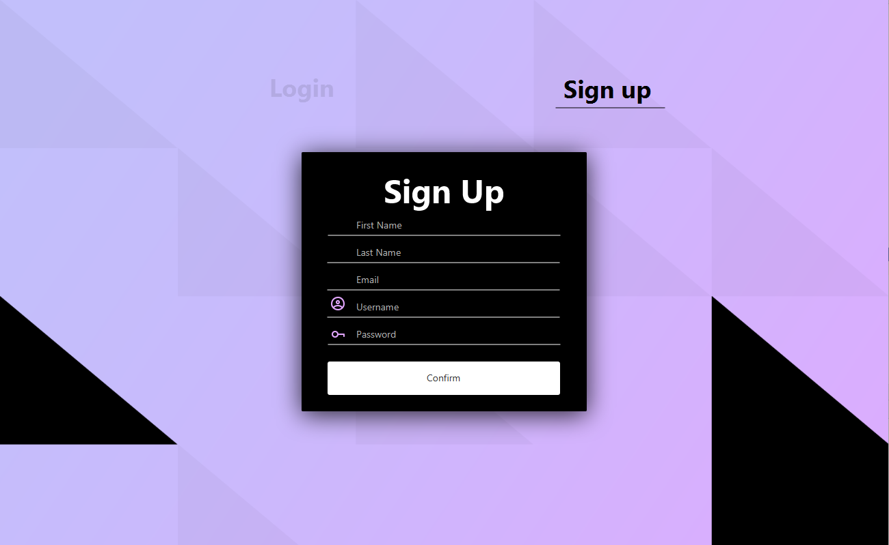

# Program Organization
Our general idea for the architecture of our program is using the microservices structure utilizing synchronous service calls between the app, database, and email system.
## System Context Diagram

The user only has permission to access the Mochi Desktop App. Starting with launching the app with a click of a button, user story 3 is addressed. Afterwards, depending on what they do within the app determines what other systems are communicated. For example, Registration, user story 1, will need to have a valid e-mail address and sending a confirmation email to the user. While user story 2, login, will need to access the Mochi Database to see if the inputted information is correct.

## System Container Diagram

The user can broken up into two categories, Buyer and Seller. Both will need to access the registration and login page. The registration needs both access to the e-mail system to send out confirmation emails, while checking the database to make sure the email is not in the system already. The login page needs database access to check if the information provided is linked to an existing account. To access both the database and e-mail system, we need to make API calls to JSON/HTTPS to then write to the database via JDBC or to the email system through SMTP.
The important thing for the Buyer is the ability to look through all available products in the database and the ability to buy. A few possible ways to sort available products is based on genre, user story 5, and price and rating, user story 12.
The important thing for the Seller is to put their product into the database to be sold, user story 6. Another critical page for the Seller is the ability to see statistics on the product, user story 6, 7, 13, 14 and 15.

## System Container Diagram

# Major Classes
## Class Diagram

The user in the class diagram should hold information that is specific to the user such as name, email and password. Within the user class should be the ability to update this information when the account is created in the registration page, plays with user story 1 and 2. Users can be separated into two distinct users, customers and sellers. The wishlist should be a list of productID with the ability to add and remove products the list as needed, this addresses user story 9 and 10. The product class should contain information specific to a product such as genre, productID, description, and price. This addresses user story 4, 5, 6, 7, 12, 15 and 16. The comment class should be available to the users with a rating and description, while being linked to a product. This addresses user story 11 and 14.

# Data Design
## Entity Relationship Diagram

The customer should be able to access the wishlist to put things into their wishlist, comments to see how other comsumers view the product, and product to be able to buy the product. The comments should be linked the product so that each comment is associated with only one product. The product should be able to be checked out so that the customer has the ability to buy the product.

# Business Rules
The user must put the correct username and password in order to enter the account. If the user forgets their password, they can change their password but the database should be updated to the new password. In order to purchase an item, users must give card information. Sellers must complete a product creation page in order to sell their product to a customer.
# User Interface Design
## Login UI

This is associated with user story 002. From this page, it is possible to go to the registration page through the "Sign up" button and to forgot page through the "Need Help?" button.
## Forgot UI

## Registration UI

- [User Interface Design (Screenshots)](User%20Interface%20Design.md)
- [User Interface Diagram](https://github.com/meaagaan/Group5Project/blob/master/Artifacts/User%20Interface%20Diagram.png)
# Resource Management
Mochi’s architecture plan for managing scarce resources like database connections is to maintain a constant connection between the user and the backend database. At the time being, this method of resource management will supply our current expected demand. Memory management will be managed by java’s inbuilt garbage collector.
# Security
We do want security for the project because we are using a database that stores users information. For security measures, when a user creates a password, it will encrypt and hash the password in the database. When the user inputs credit card information, it will store it in the database and encrypt it. For all products inputted on the system, the database will securely store each one giving each product a product id.
# Performance
Our main concern in regards to the performance of our app is the speed of our filter and sorting options when browsing products on the site. We want the sorting/filters to only take a couple of seconds maximum, so we will need to keep that in mind while coding up sorting algorithms. 
We will also want to keep in mind the amount of memory our database could potentially use, but it is less important to us than the speed of the app.
# Scalability
Scalability is something that we certainly want to keep in mind. While we don’t have any “users” for Mochi while it’s in development, we want to build it in such a way that it can potentially handle as many users and products as possible. We will be coding our sorting, reading, and writing algorithms with a  large scale in mind, and make them as robust as possible in that respect.
# Interoperability
We plan on addressing interoperability between our desktop app and the associated database by conforming to the standard Java Database Connectivity architecture. This way our database and app can communicate effectively.
# Internationalization/Location
Mochi’s interactive system will contain things such as help messages and error messages. Help messages will occur when the user inputs incorrect information such as when creating a password that doesn’t correctly meet the minimum requirements like length. Error messages will occur when the user provides a username and password that isn’t contained in the login database. Other error messages will occur when creating a product and critical information fields might be missing. Mochi plans to use ASCII as it’s chosen character set and won’t need to translate the strings into foreign languages due to the targeted audience to be able to understand english.
# Input/Output
### __Login Page:__

Within the __Login Page__, users are required to __input__ their *username* and *password* in order to use/access Mochi service. Users will receive an __output__ in the form of text that appears on the screen (right below “Login” button) when they input a wrong *username/password*.

### __Registration Page:__

To create an account, users are required to __input__ a unique *username* and *password*. Users are also required to give Mochi basic information such as Date of Birth, Email, and Phone number. However, if the *username* is already taken, users will receive an __output__ in form of text that appears on the screen telling them that the *username* is already taken.

### __Forget Username/Password Page:__

On this page, users will be asked to __input__ their Date of Birth, Email, and Phone number associated with the account that they are unable to access. After that if the given information is correct, the *username/password* will be __output__ in form of Email that will be sent directly to the provided Email.

### __Customer Support Page:__

On this page, if users want to open a ticket with us, they are required to __input__ the problem that they are experiencing. Once it is their turn, they will get an __output__ in form of a follow up Email.

### __Checkout Page:__

When purchasing a product, users are required to select the payment method and __input__ the required information depending on the payment method that they have selected. If they are successfully purchased the product, they will receive an __output__ in the form of Email, notifying them once more that they purchased a product. However, if their input is invalid, they will receive an __output__ in the form of text that appears on the screen telling them that they __input__ an invalid information.

###### *Excluding the pages that the only user input is a mouse input and the pages that do not have any output

# Error Processing
To account for all possible errors, we are planning to create test cases that will test our program thoroughly so if there are errors that we haven’t noticed, we can fix them before releasing our program. However, instead of having many errors to fix, we will write our code with all the possible errors that can occur in mind then try to code an error handling for that particular section. We believe that with this method, we will be able to prevent most of the errors from happening.
# Fault Tolerance
The fault tolerance approaches that we are aiming for are the one that when the system detects faults, it will go back to the point where everything is correct and continue again from that point. The other approach that we aim to use within our product is having auxiliary code to use when the system detects faults, so that our program can switch and use that part of the code instead.
# Architectural Feasibility
Mochi doesn’t need to worry about the system’s ability to meet with its performance targets and work within resource limitations. This is due to Mochi and it’s architecture not being resource intensive on the device used to operate the application.
# Overengineering
Mochi’s programmers will do a mix of both overengineering and siding with doing the simplest thing that works. The programmers will overengineer when user potential errors can occur, however will err more to the side of siding with doing the simplest thing that works. An overengineer example is when invalid information is inputted into text fields looking for specific requirements like length and certain characters to be contained within the string, Mochi should be able to prompt the user with error messages. On the other hand, the programmers will side with the simplest thing that works when things such as when classes working with one another doesn’t operate with the intended effect. (No clue if that makes sense)
# Build-vs-Buy Decisions
We plan to go into development with the attitude of building everything ourselves, but we want to remain open to the idea of using software that can significantly speed up and simplify our development process. Currently however we do not have any plans to use pre-existing software in our project.
# Reuse
If the need calls for using pre-existing software, test cases, data formats, or other materials, the architecture will use it. Any changes will be documented to ensure clarity that the pre-existing material isn’t an exact copy in code and functionality.
# Change Strategy
Our main strategy to help us easily welcome and support change within our project is the use of 
Microservice Architecture. We plan to structure our project in this way so that when change does occur, there will be minimal editing in preexisting code that is not directly related to the change. We also plan to standardize our style of code between developers in such a way that in the event that one of us has to edit code that another developer wrote, it will be as painless as possible.
